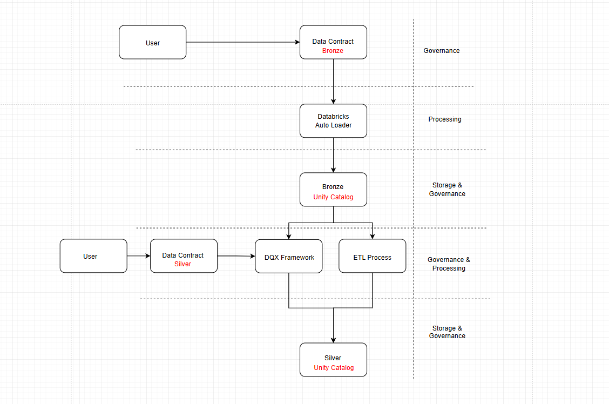
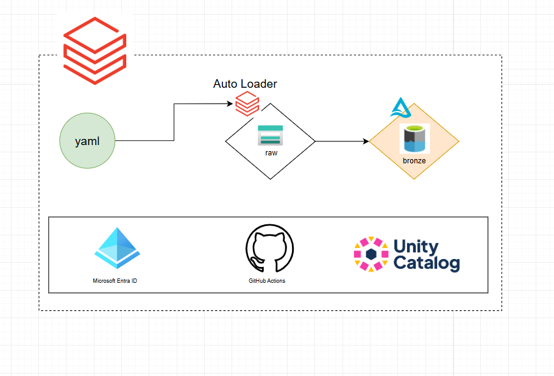
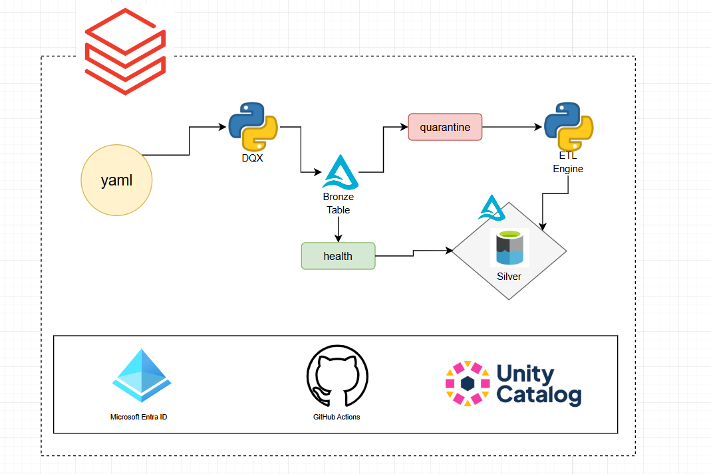

# One Data — Documentação Técnica

O repositório "One Data" é um dos componentes da solução Data Master (F1rst Santander). Solução proposta e desenvolvida por [Vinicius Otoni](http://linkedin.com/in/vinicius-otoni-b330b3295/)

> ⚠️ Antes de prosseguir, leia o repositório de infraestrutura **[Sunny Data](https://github.com/ViniciusOtoni/sunny-data)**. Todo o provisionamento (Azure + Terraform + GitHub Actions) utilizado aqui depende dele.

---

## Conteúdos do Repositório


1. [Visão Inicial](#1-visão-inicial)  
   * [Objetivo](#11-objetivo)  
   * [Ideação do Projeto](#12-ideação-do-projeto)  
   * [Interações do usuário](#13-interações-do-usuário)

2. [Arquitetura Técnica](#2-arquitetura-técnica)  
   * [Bronze (Ingestão)](#21-bronze-ingestão)  
   * [Silver (ETL + Qualidade)](#22-silver-etl--qualidade)

3. [Contratos de Dados](#3-contratos-de-dados)  
   * [Contrato Bronze (exemplo real)](#31-bronze)  
   * [Contrato Silver (exemplo real)](#32-silver)

4. [Execução (GitHub Actions + DAB)](#4-execução-github-actions--dab)  
   * [Workflows](#41-workflows)  
   * [Observações sobre o Actions](#42-observações-sobre-a-implementação-do-actions)  
   * [Databricks Asset Bundle](#43-databricks-asset-bundle)

5. [Comportamento e Limitações](#5-comportamento-e-limitações)  
   * [Bronze](#51-bronze)  
   * [Silver](#52-silver)  
   * [Customs (métodos customizados)](#53-customs-métodos-customizados)

6. [DQX — Framework de Qualidade de Dados](#6-dqx--framework-de-qualidade-de-dados)

7. [Framework de ETL (Silver) do One Data](#7-framework-de-etl-silver-do-one-data)

8. [Monitoramento](#8-monitoramento)

9. [Setup](#9-pré-requisitos-setup)

10. [Melhorias](#10-melhorias)

11. [Referências](#11-referências)

---

## 1. Visão Inicial

Esta documentação descreve a arquitetura, fluxos, contratos e mecanismos de execução do One Data, cobrindo a experiência do usuário e o funcionamento interno do código (Bronze e Silver, incluindo métodos custom). O objetivo é registrar funcionalidades, limitações conhecidas e pontos de extensão, com exemplos práticos.

### 1.1 Objetivo

O **One Data** democratiza o acesso inicial ao lakehouse, atuando em duas camadas fundamentais:

- **Bronze** → ingestão bruta governada, com rastreabilidade e padronização mínima.  
- **Silver** → padronização, enriquecimento e qualidade (DQX), preparando dados para consumo confiável.

A proposta é reduzir a dependência de alto conhecimento técnico e incentivar fluxos **automáticos**, **padronizados** e **auditáveis**.

### 1.2 Ideação do Projeto

<p align="left">
  
</p>

### 1.3 Interações do usuário

- **Bronze**: definir contrato **JSON** (schema/partições/opções de leitura) e subir arquivo para RAW.  
- **Silver**: definir contrato **YAML** (source/target, DQX, ETL, quarentena, customs).  
- **Customs**: opcionalmente declarar métodos customizados no YAML apontando para funções Python disponíveis no workspace.

---

## 2. Arquitetura Técnica

O fluxo do One Data inicia-se com o preenchimento do [Data Contract](#3-data-contract), documento responsável por descrever a estrutura e as regras esperadas do dataset. A partir desse contrato, a ingestão é realizada automaticamente por meio do Auto Loader, que garante escalabilidade e eficiência na chegada dos dados.

Em seguida, os dados passam por uma Engine interna, apoiada pelo framework [DQX](#6-dqx--framework-de-qualidade-de-dados), responsável por aplicar health checks e validações de qualidade, assegurando consistência, confiabilidade e aderência às regras de governança definidas.

### 2.1 Bronze (Ingestão)

Bronze Camada destinada à ingestão bruta dos dados, preservando o formato original e mantendo rastreabilidade completa da origem.

<p align="left">
  
</p>

* **Auto Loader** em modo `availableNow` (D‑1).
* **Schema** aplicado a partir do contrato; registros fora do schema vão para `badRecordsPath` no checkpoint.
* Escrita **Delta/UC** com criação idempotente de **tabela externa** (LOCATION + PARTITIONED BY + comentários de coluna).
* Colunas de auditoria: `ingestion_ts` (timestamp) e `ingestion_date` (date).

### 2.2 Silver (ETL + Qualidade)

Silver Camada responsável pela padronização e enriquecimento dos dados, aplicando as regras do Data Contract e validações do DQX. Aqui os dados tornam-se confiáveis e prontos para análises mais avançadas ou consumo por áreas de negócio.

<p align="left">
  
</p>

* **DQX**: checks declarados no contrato separando **válidos** e **quarentena**.
* **ETL**: sequência **declarativa** (YAML) com steps core (ex.: `trim_columns`, `normalize_dates`, `cast_columns`, `deduplicate`) e **customs** opcionais.
* **Remediação**: etapa de `quarantine.remediate` (ex.: `coerce_date`, `clamp_range`, `drop_if_null`) seguida de **re-check DQX**.
* **Write**: `merge` no destino com `merge_keys`; `still_bad` vai para o sink de quarentena informado.

> Os utilitários de escrita garantem catálogo/esquema no **Unity Catalog** e realizam `MERGE`/`APPEND` com suporte a **ZORDER BY** e **partitioning** declarados.

---

## 3. Data Contract

O One Data usa contratos versionados para descrever o dataset e as regras de qualidade.

### 3.1 Bronze

```json
{
  "version": "1.0",
  "catalog": "bronze",
  "schema": "sales_new",
  "table": "orders",
  "columns": [
    { "name": "id",          "dtype": "string",  "comment": "Order ID" },
    { "name": "created_at",  "dtype": "timestamp", "comment": "Creation time" },
    { "name": "amount",      "dtype": "decimal(18,2)", "comment": "Total amount" },
    { "name": "tags",        "dtype": "array<string>", "comment": "Labels for the order" },
    { "name": "meta",        "dtype": "struct<source:string, ts:timestamp>", "comment": "Metadata" }
  ],
  "partitions": ["created_at"],
  "source": {
    "format": "json",
    "options": { "multiline": true }
  }
}
```

**Observações**

* **JSON em array** (`[...]`) → usar `multiline: true` (evita linhas “vazias”).
* **Partições** não podem ser de **tipos complexos**.
* Os comentários das colunas são propagados para o UC.

### 3.2 Silver

```yaml
version: "1.0"

source:
  bronze_table: "bronze.sales_new.orders"

target:
  catalog: "silver"
  schema:  "sales"
  table:   "sales_clean"
  write:
    mode: "merge"
    merge_keys: ["id"]
    partition_by: ["ano","mes"]
    zorder_by: ["created_at"]

dqx:
  criticality_default: "error"
  checks:
    - name: not_null_id
      criticality: error
      check:
        function: is_not_null
        arguments:
          column: "id"

    - name: not_null_created_at
      criticality: error
      check:
        function: is_not_null
        arguments:
          column: "created_at"

    - name: unique_id
      criticality: error
      check:
        function: is_unique
        arguments:
          columns: ["id"]

    - name: amount_range
      criticality: error
      check:
        function: is_in_range
        arguments:
          column: "amount"
          min_limit: 0
          max_limit: 100000

  custom:
    - name: created_at_valid_date
      criticality: error
      check:
        function: sql_expression
        arguments:
          expression: "to_date(created_at, 'yyyy-MM-dd') IS NOT NULL"
          msg: "created_at inválido"

etl:
  standard:
    - method: trim_columns
      args:
        columns: ["id"]

    - method: normalize_dates
      args:
        columns: ["created_at"]
        format: "yyyy-MM-dd"
        project_ano_mes: true

    - method: cast_columns
      args:
        mapping:
          amount: "double"

    - method: deduplicate
      args:
        keys: ["id"]
        order_by: ["created_at desc"]

quarantine:
  remediate:
    - method: coerce_date
      args:
        column: "created_at"
        from_patterns:
          - "M/d/yyyy"
          - "MM/dd/yyyy"
          - "d/M/yyyy"
          - "dd/MM/yyyy"
          - "yyyy-MM-dd"
          - "MM-dd-yyyy"
          - "M-d-yyyy"
        to_format: "yyyy-MM-dd"

    - method: clamp_range
      args:
        column: "amount"
        min: 0.0

    - method: drop_if_null
      args:
        columns: ["id"]

  sink:
    table: "monitoring.quarantine.sales_bronze_data"

customs:
  allow: true
  registry:
    - name: discount_rule
      module: onedata.silver.customs.custom_sales_rules
      method: apply_discount_if_high_value
      args_schema:
        percent: { type: number, required: true, min: 0, max: 50 }
        threshold: { type: number, required: true, min: 0 }
  use_in:
    - stage: standard
      method: discount_rule
      args:
        percent: 10
        threshold: 1000
```

**Observações**

* A ordem declarada no YAML impacta diretamente a execução: os métodos do bloco etl.standard (conforme o exemplo) são executados na sequência em que aparecem.

* O contrato de Silver organiza regras e transformações em quatro blocos principais:

   * dqx: define as verificações de qualidade (ex.: is_not_null, is_unique, is_in_range) e checks custom via sql_expression.

   * etl: lista os métodos de transformação padronizados (ex.: trim_columns, normalize_dates, cast_columns, deduplicate) e controla a ordem de aplicação.

   * quarantine: concentra as remediações que só se aplicam aos registros reprovados nos checks (ex.: coerce_date, clamp_range, drop_if_null) e define o sink.table para descarte controlado dos irrecuperáveis.

   * customs: habilita e registra métodos customizados do repositório, com validação de parâmetros e indicação de onde serão executados.

* O bloco target.write controla o mode, as merge_keys, partition_by e zorder_by — esses campos afetam idempotência e desempenho.
---

## 4. Execução (GitHub Actions + DAB)

### 4.1 Workflows

* **10 - Upload arquivo para RAW**
  Faz upload de um arquivo do repositório (`data/input/*`) para o container **raw** do ADLS.

* **20 - Deploy & Run (DAB)**

  * Build & Test da wheel (src/onedata).
  * Lê **workspace_id** do tfstate remoto e exporta as ENVs necessárias (incluindo SPN dinâmica para **run_as**).
  * DAB: bundle validate → bundle deploy → bundle run para acionar o Job que executa Bronze → Silver.

### 4.2 Observações sobre a implementação do Actions

* OIDC com Azure: autenticação federada (via azure/login) evita segredo estático e mantém auditoria no Entra ID.

* DAG entre jobs: orquestra dependências entre build, deploy e run, garantindo ordem e reprodutibilidade.

* Segurança/Segredos: segredos sensíveis não trafegam; são lidos do Azure Key Vault (via [Sunny Data](https://github.com/ViniciusOtoni/sunny-data)).

* Reprodutibilidade: cada execução reflete o estado versionado do bundle e dos contratos (YAML/JSON).

* Escopo enxuto: o sync.include (DAB) limita o payload para o workspace, acelerando deploys e reduzindo drift.

### 4.3 Databricks Asset Bundle

##### Proposta do DAB no projeto

O DAB descreve artefatos (seu pacote Python em wheel) e recursos Databricks (Jobs) como configuração versionável em databricks.yaml. Assim, controla o que executar, como executar e com qual identidade por ambiente (targets).

Como é usado?

* Artefato: Python wheel construída de src/onedata.

* Recurso: Job com python_wheel_task chamando entry points (ex.: Bronze), em job clusters efêmeros.

* Identidade: run_as.service_principal_name = SPN dinâmica, garantindo auditoria/governança.

* Target dev: concentra parâmetros e sync.include (somente código/contratos necessários), reduzindo upload e tempo de deploy.

##### Ciclo operacional

* databricks bundle validate → valida variáveis, paths e recursos.

* databricks bundle deploy → empacota e publica no workspace (/.bundle/<nome>/<target>/...).

* databricks bundle run -t <target> <job> → dispara o Job do bundle para o target.

##### Variáveis & parametrização

* Declaradas em variables: e injetadas por ENV com DATABRICKS_BUNDLE_VAR_<nome> (ex.: dynamic_spn_client_id).

* targets: permitem diferenciar ambientes (ex.: DBR version, node_type_id, sync.include).

##### Benefícios práticos

* Menos drift: evita configurações manuais no workspace.

* Reprodutível: mesmo bundle → mesmo resultado por target.

* Governança: execução com SPN dinâmica (run_as).

* Deploys rápidos: sync.include enxuto e job clusters efêmeros.

**Atenções!**

* A wheel precisa de empacotamento válido (ex.: pyproject.toml/setup.cfg).

* Somente módulos dentro de sync.include ficam disponíveis no cluster (evite import fora desses caminhos).

* Trocas de cluster_spark_version/node_type_id impactam custo e compatibilidade.

---

## 5. Comportamento e Limitações

### 5.1 Bronze

* **JSON (array)**: requer `multiline: true` no contrato.
* **Partições**: não suportam tipos complexos e **devem existir no schema**.
* **Backlog**: existe suporte a `includeExistingFiles` (por execução); checkpoints são isoláveis por `reprocess_label`.
* **Schema enforcement**: registros fora do schema são enviados a `badRecordsPath` (útil para debug).

### 5.2 Silver

* **Ordem importa**: steps de `etl.standard` rodam **na ordem declarada**. Ex.: normalizar datas **antes** dos checks reduz falsos positivos; `deduplicate` depois de `cast_columns` evita múltiplas versões de uma mesma chave de merge.
* **Merge**: `merge_keys` devem estar presentes e, após `deduplicate`, serem únicas; caso contrário, o MERGE pode falhar ou sobrescrever linhas indevidamente.
* **Quarentena**: o `sink.table` é respeitado, porém a escrita é feita como **tabela externa** usando a base configurada por `SILVER_EXTERNAL_BASE`. Ou seja, mesmo com FQN `monitoring.*`, o **LOCATION** físico fica sob a base da Silver. Se desejar bases físicas distintas por catálogo, será necessário estender o código.
* **Z-Order e Particionamento**: aplicados conforme contrato; mau uso pode degradar performance (ex.: `zorder_by` em coluna de baixa cardinalidade).
* **Monitoria**: `PipelineRunLogger` é **soft‑dependency**; sem libs/ENVs da Azure o logger vira no‑op (a execução do pipeline não para).

### 5.3 Customs (métodos customizados)

* **Registro e uso**: `customs.registry` define *onde* (módulo/método) e o `args_schema` de validação; `customs.use_in` escolhe **em qual estágio** aplicar.
* **Assinatura esperada**: `fn(df: DataFrame, **kwargs) -> DataFrame`.
* **Segurança**: o loader suporta restrição por prefixos de módulo e exige marcação via decorator `@custom` (ver `src/onedata/silver/customs/sdk.py`).
* **Flags de execução**: o runner expõe flags/ENVs para modo estrito e prefixos permitidos (ver `src/onedata/silver/application/settings.py`).

Exemplo (já incluído no repo):

```python
# src/onedata/silver/customs/custom_sales_rules.py
from pyspark.sql import DataFrame, functions as F
from onedata.silver.customs.sdk import custom

@custom
def apply_discount_if_high_value(df: DataFrame, percent: float, threshold: float) -> DataFrame:
    # Se amount >= threshold, aplica desconto e marca discount_applied
    if percent < 0 or percent > 50:
        raise ValueError("percent fora do intervalo [0,50]")
    if "amount" not in df.columns:
        raise ValueError("coluna 'amount' ausente")
    return (
        df
        .withColumn("discount_applied", (F.col("amount") >= F.lit(threshold)))
        .withColumn("amount", F.when(F.col("discount_applied"), F.col("amount") * (1 - percent/100)).otherwise(F.col("amount")))
    )
```

---

# 6. DQX — Framework de Qualidade de Dados

O DQX (Databricks Labs) é um framework de qualidade de dados para PySpark que permite definir, validar e monitorar regras de qualidade sobre DataFrames (batch ou streaming). Ele fornece funções prontas (ex.: is_not_null, is_unique, is_in_range) e possibilita checks customizados (ex.: expressões SQL), retornando detalhes sobre por que cada check falhou e facilitando estratégias de quarentena e remediação.

### Como o One Data utiliza?

* O DQX é acionado na Silver (bloco dqx do contrato), separando válidos de inválidos antes do merge.

* Checks custom (ex.: sql_expression) cobrem regras específicas de negócio.

* Os resultados orientam a etapa quarantine.remediate, onde os dados problemáticos são corrigidos e revalidados.

**Melhor conhecimento sobre o DQX**

- GitHub (Databricks Labs): https://github.com/databrickslabs/dqx
- Docs: https://databrickslabs.github.io/dqx/

> Observação: DQX é um projeto Labs (open-source, evolução contínua). Consulte o repositório para evolução e breaking changes.

---

# 7. Framework de ETL (Silver) do One Data

O framework de ETL da Silver é declarativo, dirigido por YAML e construído para ser genérico (padronização) com pontos de extensão controlados (customs). Ele não cria features além do que está no repo — atua exatamente conforme o contrato fornecido.

### Estrutura (espelhando o YAML)

* source: origem FQN (ex.: bronze.sales_new.orders).

* target: destino FQN + estratégia de escrita (mode, merge_keys, partition_by, zorder_by).

* dqx: regras de qualidade (nativas + sql_expression).

* etl.standard: sequência de métodos built-in (ex.: trim_columns, normalize_dates, cast_columns, deduplicate).

* quarantine: remediação dos reprovados (ex.: coerce_date, clamp_range, drop_if_null) e sink.table para descarte controlado.

* customs: registro e aplicação de métodos custom com args_schema e estágio (use_in.stage) definidos.

### Ordem dos métodos (comportamento real)

A ordem declarada em etl.standard é a ordem de execução.

Ex.: normalize_dates antes do DQX reduz falsos negativos em datas; deduplicate após cast_columns evita chaves de merge duplicadas por variação de tipo.

### Escrita e idempotência

write.mode: merge + merge_keys definem o upsert.

Após DQX e remediação, somente válidos vão para o destino; inválidos persistentes seguem para o sink.table.

O utilitário de escrita respeita o FQN no UC, mas fisicamente usa a base definida por [SILVER_EXTERNAL_BASE](#52-silver).

### Extensibilidade segura (customs)

* Carregamento controlado por prefixo de módulo + decorator @custom.

* Validação de parâmetros via args_schema.

* Contrato manda: onde e como aplicar (sem writes dentro do método).

---

## 8. Monitoramento

O monitoramento do **One Data** garante visibilidade, auditoria e rastreabilidade de todas as execuções do pipeline, desde a ingestão (Bronze) até a aplicação de qualidade e transformação (Silver). Ele foi desenhado para funcionar em camadas:

### 8.1 Nível de execução

- **GitHub Actions**: cada pipeline CI/CD registra logs completos da execução, incluindo etapas de build, deploy e run.  
- **Databricks Workflows/Jobs**: a execução dos *bundles* gera logs no próprio workspace (disponíveis via UI ou API), contendo métricas de tarefas, tempo de execução e possíveis falhas.

### 8.2 Nível de dados

- **PipelineRunLogger**: módulo interno responsável por registrar métricas de ingestão e transformação (ex.: número de registros válidos, inválidos, enviados à quarentena).  
  - Funciona como *soft-dependency*: se não houver integração com Azure, os logs são ignorados sem interromper a execução.  
  - Quando habilitado, envia registros para **Azure Table Storage**.

- **DQX**: framework utilizado na camada Silver. Além de validar regras, gera relatórios detalhados sobre quais registros falharam em cada *check*. Esses relatórios são fundamentais para auditoria e podem ser integrados com monitorias externas.

### 8.3 Nível de quarentena

- Todos os dados rejeitados no DQX ou impossíveis de remediação são persistidos em **tabelas de quarentena** (ex.: `monitoring.quarantine.*`).  
- Essas tabelas permitem:  
  - Identificar tendências de falha (ex.: contratos mal configurados, fontes corrompidas).  
  - Fornecer feedback rápido para usuários que definiram o contrato.  
  - Evitar perda de dados — nada é simplesmente descartado.

### 8.4 Alertas e auditoria

- **Observabilidade Azure**: integração opcional com **Azure Monitor / Application Insights / Log Analytics** pode ser habilitada para capturar logs de execução e eventos críticos.  
- **Auditoria de Identidade**: como o bundle executa com a SPN dinâmica (`run_as.service_principal_name`), cada ação é registrada no **Entra ID** e no **Databricks Audit Logs**, garantindo rastreabilidade.

### 8.5 Benefícios do modelo de monitoramento

- **Transparência**: cada etapa do pipeline pode ser auditada, desde a subida do arquivo até o merge final.  
- **Governança**: dados inválidos nunca são perdidos; sempre ficam acessíveis em quarentena.  
- **Ação rápida**: logs centralizados em Azure Monitor + métricas de DQX permitem identificar erros de qualidade em tempo quase real.  
- **Escalabilidade**: o monitoramento acompanha a esteira de dados sem sobrecarregar o fluxo principal.

## 9. Pré-requisitos (Setup)

- Conta na Azure
- Subscrição na Azure
- Realizar o az login

### 9.1 Criaçao da SPN Bootstrap:

````bash
az ad sp create-for-rbac --name "terraform-admin-spn-user" --role="Contributor" --scopes="/subscriptions/<subscriptionID>"
````

Será retornado o *PASSWORD*, *TENANT* e *APPID* após a criação. Esses valores, precisam ser cadastrados nas Secrets do repositório GitHub.

- **ARM_CLIENT_SECRET** -> *PASSWORD*
- **ARM_TENANT_ID** -> *TENANT*
- **ARM_CLIENT_ID** -> *APPID*
- **ARM_SUBSCRIPTION_ID** -> *subscriptionID*

<video width="40%" height="300px" controls>
  <source src="./assets/videos/adicionar-secret.mp4" type="video/mp4">
</video>

- Recupere o *OBJECT_ID* para gravar na secret **ARM_OBJECT_ID**

````bash
az ad sp show --id <appId> --query id -o tsv  
````

- Cadastre os valores seguindo esse formato em JSON na secret **AZURE_CREDENTIALS**

````json
{
  "clientId": <appId>,
  "clientSecret": <password>,
  "tenantId":   <tenant>,
  "subscriptionId": <subscriptionId>
}
````

- Atribua a role de *User Access Administrator* para a SPN

````bash
az role assignment create \
    --assignee-object-id <SPN_OBJECT_ID> \
    --role "User Access Administrator" \
    --scope "/subscriptions/<subscriptionId>"
````

- Atribuir a SPN como Cloud Application Administrator

<video width="40%" height="300px" controls>
  <source src="./assets/videos/cloud-application.mp4" type="video/mp4">
</video>

- Adicione essas duas roles no Microsoft Graph *Directory.ReadWrite.All* e *Group.ReadWrite.All*

<video width="40%" height="300px" controls>
  <source src="./assets/videos/MicrosoftGraph.mp4" type="video/mp4">
</video>

### 9.2 Atribuição da SPN dinâmica como Account Admin

> Essa etapa deve ser realizada apenas quando o workflow databricks-workspace exigir validação no JOB **🚦 Aguardar grant account_admin**

- Entre no console de account do Databricks (https://accounts.azuredatabricks.net/)
    Para logar, informe o seu e-mail **UPN** recuperado no Microsoft Entra ID

<video width="40%" height="300px" controls>
  <source src="./assets/videos/UPN.mp4" type="video/mp4">
</video>

- Atribua a SPN dinâmica como Account Admin

<video width="40%" height="300px" controls>
  <source src="./assets/videos/accountAdmin.mp4" type="video/mp4">
</video>


- Delete o metastore criado por Default

<video width="40%" height="300px" controls>
  <source src="./assets/videos/metastore.mp4" type="video/mp4">
</video>

- Recupere o valor do Account ID e grave na secret do GitHub **ARM_ACCOUNT_ID**

<video width="40%" height="300px" controls>
  <source src="./assets/videos/accountID.mp4" type="video/mp4">
</video>

- Aprovar JOB para finalização do Workflow

<video width="40%" height="300px" controls>
  <source src="./assets/videos/approvement.mp4" type="video/mp4">
</video>

### 9.3 Workflow de execução do One Data

* Execute o workflow **10 - Upload arquivo para RAW**, responsável por enviar seu arquivo (ex: JSON, CSV, TXT..) para o container `raw` do SA. Após isso, o workflow **20 - Deploy & Run (DAB)**, será iniciado de forma automática, dando início no processo de deployment do JOB Databricks e execução do mesmo.

--- 

## 10. Melhorias

Pontos a serem melhorados para maior **robustez** e **qualidade** do projeto.

### 10.1 Segurança e Governança

 * SCIM/Grupos de Conta: migrar criação de grupos para account-level via SCIM e databricks_mws_permission_assignment, evitando drift de permissões.

 * Policies de Cluster/SQL Warehouse: aplicar cluster policies mínimas (versão DBR LTS, autoscaling, tags, init scripts restritos).

 * Catálogo de External Locations: validar que credenciais/external locations têm least privilege com READ FILES apenas onde necessário.

### 10.2 Confiabilidade e Qualidade

 * Schema Evolution Controlado (Bronze): permitir cloudFiles.schemaEvolutionMode opcional (e.g. addNewColumns) com guard rails via contrato.

 * Alertas de Schema Drift: comparar contrato vs. schema observado e emitir event (Azure Monitor) quando houver divergência.

 * DQX Enriquecido: adicionar checks de referential integrity (via join probes configuráveis) e limites percentuais de erro por dataset.

### 10.3 Performance e Custos

 * Auto Optimize/Compaction: habilitar auto compaction e optimize writes para tabelas alvo; agendar OPTIMIZE ZORDER em colunas de alta seletividade.

 * Small Files: tuning de maxFilesPerTrigger e cloudFiles.maxBytesPerTrigger no Auto Loader para evitar small files.

 * Caching Seletivo: cache somente em steps de transformação pesados e reutilizados (em clusters com memória suficiente).

### 10.4 Manutenibilidade e DX

 * Versionamento de Contratos: adotar semver + migrações (ex.: v1 → v1.1), validando com Pydantic e gerando changelog automático.

 * CLI do Projeto: criar onedata CLI (Typer/Click) para validar contratos, plan de execução e dry-run local.

### 10.5 Roadmap Databricks

 * DLT (Delta Live Tables): opcionalmente migrar a orquestração da Silver para DLT com expectations nativas e event log centralizado.

 * Unity Catalog - Data Discovery: padronizar TBLPROPERTIES (owner, domain, pii_level) e column comments para catálogos de dados.

## 11. Referências

* [Sunny Data (Infra/Terraform)](https://github.com/ViniciusOtoni/sunny-data): 
* [Databricks](https://learn.microsoft.com/pt-br/azure/databricks/)
* [DAB Databricks Asset Bundles](https://learn.microsoft.com/pt-br/azure/databricks/dev-tools/bundles/)
* [GitHub Actions](https://github.com/features/actions?locale=pt-BR)
* [Azure Table Storage](https://learn.microsoft.com/en-us/azure/storage/tables/table-storage-overview)
* [DQX Framework](https://databrickslabs.github.io/dqx/)
* [Arquitetura Medallion](https://www.databricks.com/glossary/medallion-architecture)
* [Least Privilege](https://learn.microsoft.com/en-us/entra/id-governance/scenarios/least-privileged)
* [Auto Loader](https://learn.microsoft.com/pt-br/azure/databricks/ingestion/cloud-object-storage/auto-loader/)
